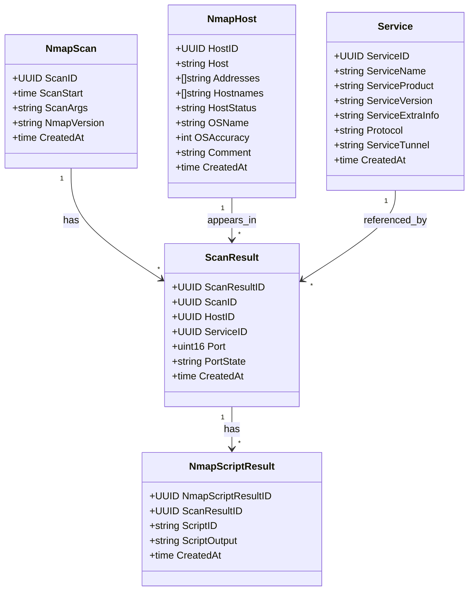

# Shiryoku-db

This layer interacts directly with the database*s*.

## Architecture

Multiple kinds of database can be used: OpenSearch/ElastricSearch, MySQL, etc. The idea is to provide an interface for the other layers.

It is better if we can use a similar interface between all engines, as it will make it simpler to work with.

### Nmap DB

