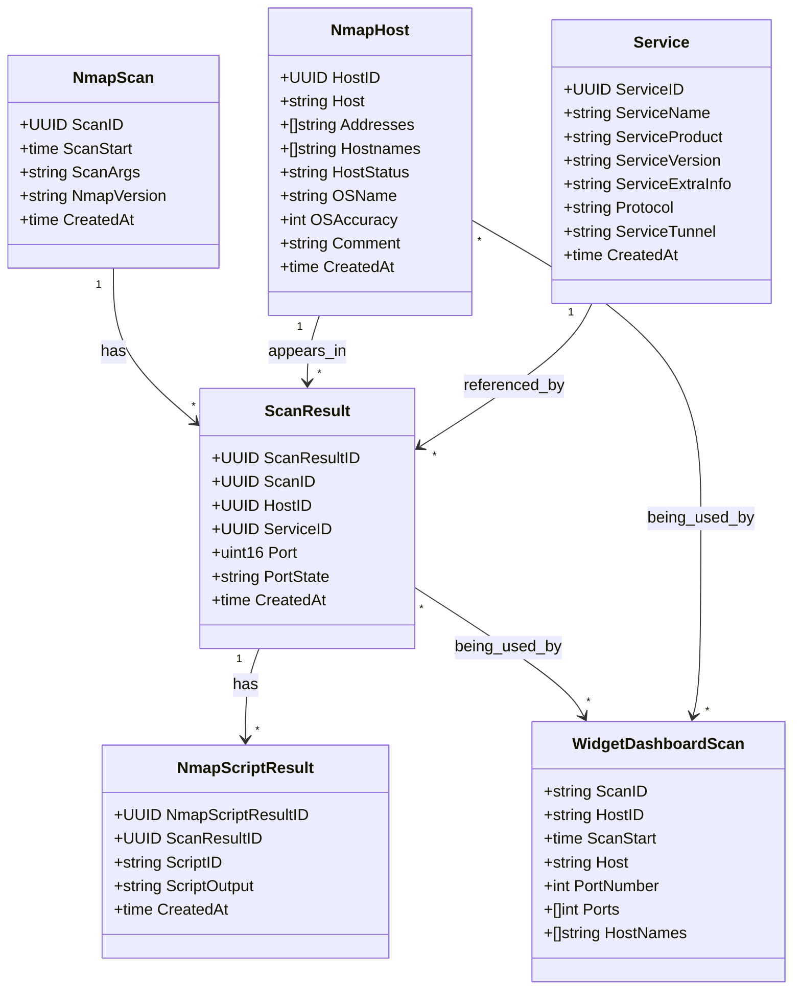

# Shiryoku-db

This layer interacts directly with the database*s*.

## Architecture

Multiple kinds of database can be used: OpenSearch/ElastricSearch, MySQL, etc. The idea is to provide an interface for the other layers.

> [!NOTE]
> We will mostly use Postgres databases.

It is better if we can use a similar interface between all engines, as it will make it simpler to work with.

To do that, we will use `SearchParams` (taken from [diracx](https://github.com/DIRACGrid/diracx/blob/main/diracx-core/src/diracx/core/models/search.py)). It provides a quite solid interface to the user as well as developper to build complex requests. For example:

```json
{
    "search": [
        {
            "parameter": "host",
            "operator": "eq",
            "value": "1.1.1.1"
        }
    ]
}
```

## Nmap storage

Nmap storage is divided in two parts: main storage, and the dashboard's. The first one is the result of every nmap scans, and the other one is dedicated to displaying scans on a dashboard (views calculated from the whole data).


